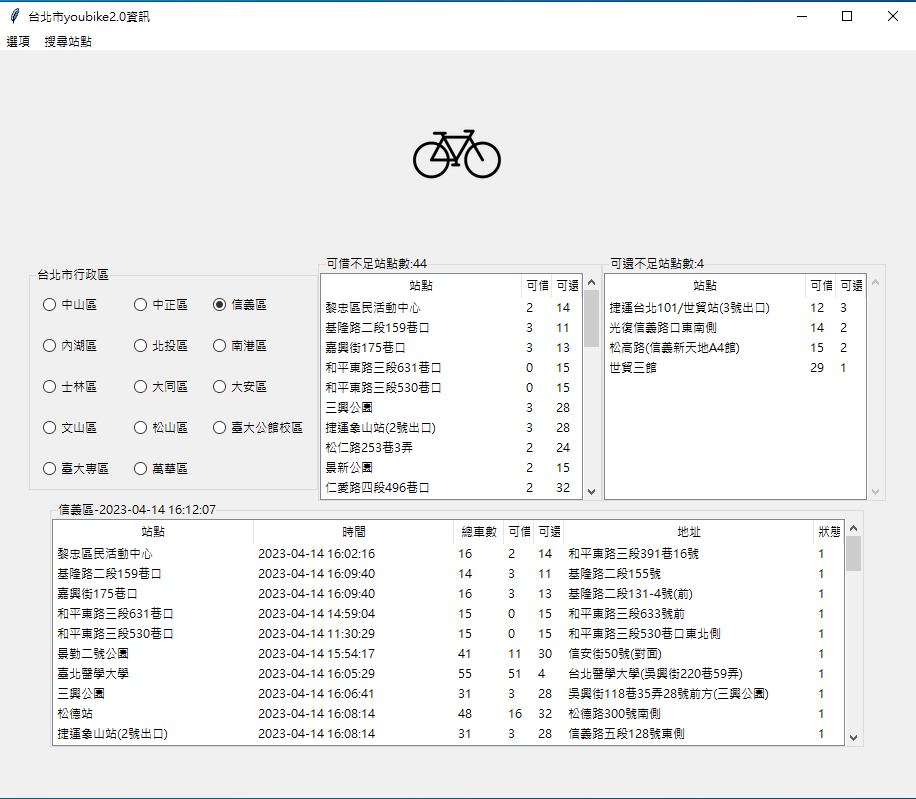

## youbike2.0的資訊
展示圖片

```
main.py是主程式 datasource.py是資料處理的程式 test.ipynb是測試檔 messageWindow是主程式的訊息視窗
```
main.py主程式內容有
1.建立行政區的Frame
2.建立(多選一選項)的事件
3.取得行政區的名稱
4.預設選項選擇為信義區
5.傳出資料的funtion
datasource.py
1.下載資料
2.抓資料
3.排序資料並傳出

新增的程式碼如下：
```python
from tkinter.simpledialog import askinteger,askstring

#建立一個menu
self.menubar = tk.Menu(self)
self.config(menu=self.menubar)
#建立選項menu
self.command_menu = tk.Menu(self.menubar)
self.command_menu.add_command(label="設定",command=self.menu_setting_click)
self.command_menu.add_command(label="離開", command=self.destroy)
self.menubar.add_cascade(label="選項", menu=self.command_menu)
#建立搜尋menu
self.search_menu = tk.Menu(self.menubar)
self.search_menu.add_command(label="搜尋",command=self.search_site_Total)
self.menubar.add_cascade(label="搜尋站點",menu=self.search_menu)

def search_site_Total(self):
        #建立KeyInWord的askstring
        KeyInWord = askstring("請輸入關鍵字", "ex:信義區")
        #刪除tree裡面的資料
        for item in self.tree.get_children():
            self.tree.delete(item)
        #增加關鍵字的資料到tree裡面
        for item in self.area_data:
            if KeyInWord in item['sna'] or KeyInWord in item['ar']:
                self.tree.insert('', tk.END, values=[item['sna'][11:], item['mday'], item['tot'], item['sbi'], item['bemp'], item['ar'], item['act']])
        #sbi_warnign_data
        for item in self.sbi_tree.get_children():
            self.sbi_tree.delete(item)
        sbi_sites_numbers = 0
        for item in self.sbi_warning_data:
            if KeyInWord in item['sna']:
                self.sbi_tree.insert('', tk.END, values=[item['sna'][11:], item['sbi'], item['bemp']], tags=item['sna'])
                sbi_sites_numbers += 1
            self.sbi_warningFrame.configure(text=f"可借不足站點數:{sbi_sites_numbers}")
        
        for item in self.bemp_tree.get_children():
            self.bemp_tree.delete(item)
        bemp_site_number = 0
        for item in self.bemp_warning_data:
            if KeyInWord in item['sna']:
                self.bemp_tree.insert('', tk.END, values=[item['sna'][11:], item['sbi'], item['bemp']], tags=item['sna'])
                bemp_site_number += 1
            self.bemp_warningFrame.configure(text=f"可還不足站點數:{bemp_site_number}")
```

問題:
1.搜尋完點tree會在主程式的143行出現IndexError
2.搜尋不寫東西按Cancel會在主程式的160行出現TypeError