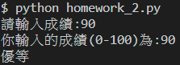

# 作業2

```python
scores = int(input("請輸入成績:"))


print(f"你輸入的成績(0-100)為:{scores}")
if (scores >= 90 ):
    print("優等")
else:
    if(scores >= 80):
        print("甲等")
    else:
        if(scores >= 70):
            print("乙等")
        else:
            if(scores >=60):
                print("丙等")
            else:
                print("丁等")  
```
執行結果如下圖:
